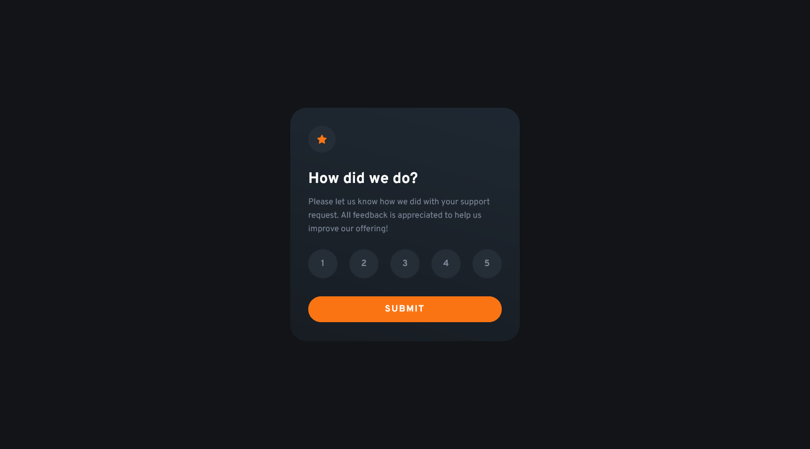

# Frontend Mentor - Interactive rating component solution

This is a solution to the [Interactive rating component challenge on Frontend Mentor](https://www.frontendmentor.io/challenges/interactive-rating-component-koxpeBUmI). Frontend Mentor challenges help you improve your coding skills by building realistic projects.

## Table of contents

- [Overview](#overview)
  - [The challenge](#the-challenge)
  - [Screenshot](#screenshot)
  - [Links](#links)
- [My process](#my-process)
  - [Built with](#built-with)
  - [What I learned](#what-i-learned)
  - [Continued development](#continued-development)
- [Author](#author)
- [Acknowledgments](#acknowledgments)

## Overview

### The challenge

Users should be able to:

- View the optimal layout for the app depending on their device's screen size
- See hover states for all interactive elements on the page
- Select and submit a number rating
- See the "Thank you" card state after submitting a rating

### Screenshot



### Links

- Solution URL: [Solution](https://your-solution-url.com)
- Live Site URL: [Live Site](https://your-live-site-url.com)

## My process

### Built with

- HTML5 template
- CSS custom properties
- CSS animations
- Flexbox
- CSS Grid

### What I learned

I practiced using HTML template to render the thank you page after clicking the submit button, and also learned how to create linear gradients for the background of the card

```html
<main>
  <div class="card-container">[...]</div>
</main>

<template>
  <div class="card-container thank-you">[...]</div>
</template>
```

```css
background-image: linear-gradient(
  15deg,
  var(--clr-neutral-800) -80%,
  var(--clr-neutral-600) 150%
);
```

Here adding a event listener to the submit button and clearing the previous card content to render the newer ones while also appending and updating it's contents.

```js
submitButton.addEventListener("click", () => {
  if (rate != 0) {
    root.innerHTML = "";
    root.append(cardThankYou.content.cloneNode(true));
    const rateLabel = document.querySelector("#rate");
    const emoji = document.querySelector("#emoji");
    rateLabel.innerHTML = rate;
    emoji.innerHTML = getEmoji(rate);
  }
});
```

### Continued development

I've found difficult to work with responsive layouts while updating the DOM, this is something that I want to work on to improve in future projects. Also dealing with responsive designs in general and using media queries.

## Author

- Frontend Mentor - [@MateusAbelli](https://www.frontendmentor.io/profile/MateusAbelli)

## Acknowledgments

I used this [Code Pen](https://codepen.io/ash_s_west/pen/GRZbvym?editors=0100) template to build my buttons animations

